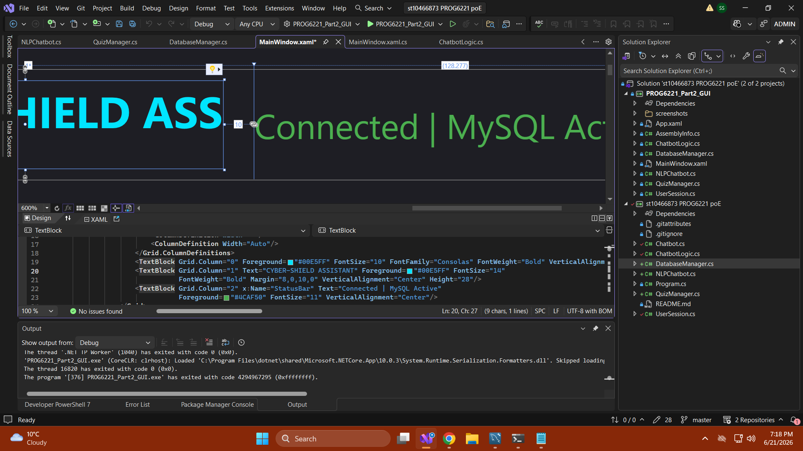
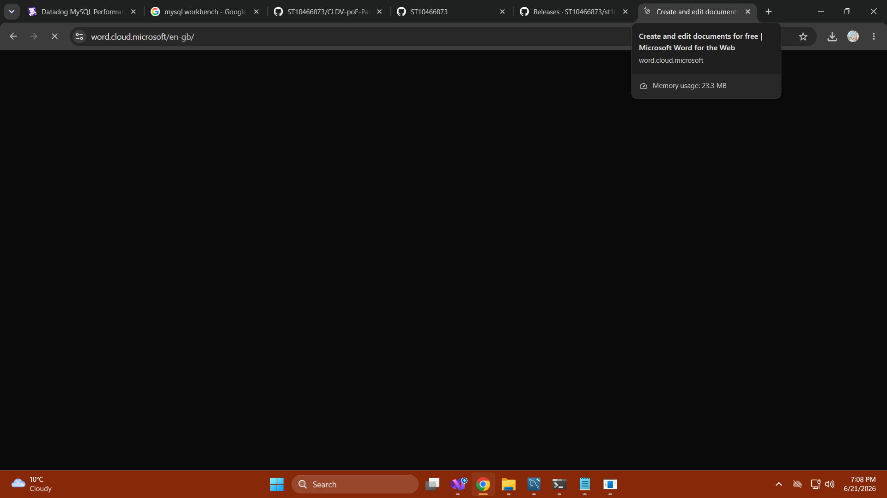

# Cyber-Shield Assistant

A **Cybersecurity Awareness Chatbot** built in C# (.NET 10) with a WPF GUI interface. This application educates South African citizens on cybersecurity topics through interactive conversation, task management, quizzes, and activity tracking.

## Project Overview
This project is a functional, WPF-based chatbot developed for South African citizens to improve cybersecurity literacy. It simulates real-life scenarios to educate users on password safety, phishing scams, and identifying digital threats. This repository contains the complete Portfolio of Evidence (POE) requirements.

## Features

| Feature | Description |
|---------|-------------|
| **Chat** | Conversational AI that detects 10+ cybersecurity keywords with varied random responses, sentiment awareness, and topic memory |
| **Tasks** | Full CRUD task management with MySQL database persistence, reminders, and completion tracking |
| **Quiz** | 11-question cybersecurity quiz with instant feedback, scoring, and progress tracking |
| **Activity Log** | Timestamped history of all user actions with recent/all/clear options |
| **NLP Simulation** | Natural language processing for task creation, log viewing, and system commands |
| **Sentiment Detection** | Adapts tone based on detected user mood (Anxious, Curious, Frustrated, Excited, Neutral) |
| **Database** | MySQL 8.0 backend for persistent task storage with error-handled CRUD operations |

## Prerequisites

- [.NET 10 SDK](https://dotnet.microsoft.com/download/dotnet/10.0)
- [MySQL Server 8.0](https://dev.mysql.com/downloads/mysql/) running on localhost:3306
- [MySQL Workbench](https://dev.mysql.com/downloads/workbench/) (optional, for DB management)

## Database Setup

The app connects to `localhost:3306` with user `root`. Run the following SQL to set up the database:

```sql
CREATE DATABASE IF NOT EXISTS CybersecurityBotDB;
USE CybersecurityBotDB;
CREATE TABLE IF NOT EXISTS CyberTasks (
    Id INT AUTO_INCREMENT PRIMARY KEY,
    Title VARCHAR(255) NOT NULL,
    Description TEXT,
    ReminderDate DATETIME NULL,
    IsCompleted BOOLEAN DEFAULT FALSE,
    CreatedAt TIMESTAMP DEFAULT CURRENT_TIMESTAMP
);
```

**Default connection:** `Server=localhost;Database=CybersecurityBotDB;Uid=root;Pwd=@Labs2026!`

## How to Run

### GUI Application (Part 2 / POE)
```bash
cd PROG6221_Part2_GUI
dotnet run
```

### Console Application (Part 1)
```bash
cd "st10466873 PROG6221 part1"
dotnet run
```

## Usage Guide

1. **Start the app** - The GUI launches with a dark-themed interface and ASCII art
2. **Enter your name** - The bot remembers you throughout the session
3. **Chat** - Type cybersecurity questions about passwords, phishing, malware, etc.
4. **Tasks** - Switch to the Tasks tab to add, complete, or delete tasks
5. **Quiz** - Test your knowledge with 11 interactive cybersecurity questions
6. **Activity Log** - Track all your interactions in the Log tab

## Project Structure

```
├── PROG6221_Part2_GUI/           # WPF GUI Application (Part 2 / POE)
│   ├── MainWindow.xaml           # Tabbed GUI layout (Chat/Tasks/Quiz/Log)
│   ├── MainWindow.xaml.cs        # Main window code-behind with all feature wiring
│   ├── ChatbotLogic.cs           # Core chatbot with 10 keyword topics
│   ├── DatabaseManager.cs        # MySQL CRUD operations
│   ├── NLPChatbot.cs             # NLP simulation with activity logging
│   ├── QuizManager.cs            # 11-question cybersecurity quiz engine
│   ├── UserSession.cs            # User state, memory, and sentiment tracking
│   └── screenshots/              # Application screenshots
├── st10466873 PROG6221 part1/    # Console Application (Part 1)
│   ├── Program.cs                # Entry point
│   ├── Chatbot.cs                # Console chatbot with ASCII art & voice
│   ├── ChatbotLogic.cs           # Shared chatbot logic
│   ├── DatabaseManager.cs        # MySQL CRUD operations
│   ├── NLPChatbot.cs             # NLP simulation
│   ├── QuizManager.cs            # Quiz engine
│   └── UserSession.cs            # User session tracking
└── st10466873 PROG6221 poE.slnx  # Solution file linking both projects
```

## Version Control & CI

- **Releases/Tags:**
  - `v1.0.0` - Initial release: Console chatbot with ASCII art, voice greeting, keyword responses, and WPF GUI framework
  - `v1.1.0` - Database integration: MySQL task management with full CRUD operations
  - `v1.2.0` - Full feature release: GUI overhaul with Quiz, Activity Log, expanded chatbot
- **CI Implementation:** A GitHub Actions workflow is configured in the `.github/workflows` directory to ensure build stability.

## Key Technical Features

- **Sentiment Detection:** Uses Delegates to detect user emotions and adjust response tone
- **Memory & Recall:** Remembers user's name, favorite topics, and conversation history
- **Keyword Recognition:** Responds specifically to 10 cybersecurity topics
- **Randomized Tips:** Uses Dictionaries and Lists to ensure varied, engaging interactions
- **Database Integration:** MySQL with full CRUD for task persistence
- **GUI Design:** Tabbed WPF interface with dark theme and professional styling

## Screenshots

### GUI Application (Full View)





### Part 1 (Console)


## GitHub & Video

- **GitHub Repository:** https://github.com/ST10466873/st10466873-PROG6221-part1
- **YouTube Presentation:** [Video Link Here]

## References

- OpenAI. 2026. ChatGPT. [Generative AI]. Available at: https://chatgpt.com [Accessed 11 May 2026].
- Patorjk.com. 2026. TAAG - Text to ASCII Art Generator. [Online]. Available at: https://patorjk.com/software/taag/ [Accessed 11 May 2026].

## License

Educational project for PROG6221 - ST10466873.
